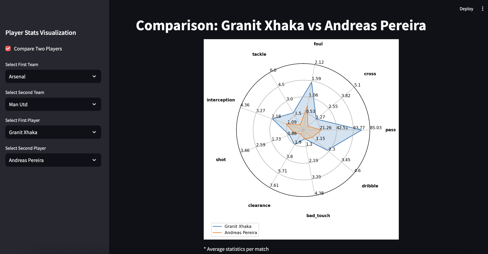

# Sport radar chart

This is a small project to build a dashboard for visualizing player's metrics in a radar chart. The main focus was on parsing soccerdata.WhoScored data, saving data in a PostgreSQL database, calculating player statistics, running a Streamlit application, and testing the application's basic components.


The application's UI is shown below and includes an option to compare the statistics of two players. The radar chart displays statistics such as `pass`, `cross`, `foul`, `tackle`, `interception`, `shot`, `clearance`, `bad_touch`, `dribble`.



To run the application, ensure you have Docker installed on your machine and execute the following commands from the root directory:

```
cd project/
docker compose up --build
```

You can access the dashboard at `http://localhost:8501`

#### Database
Since the initial data is tabular, a relational database (PostgreSQL) was used. The database consists of two tables: `spadl` and `dashboard`.

- `spadl` contains all technical-tactical actions of players on the field in the SPADL format.
- `dashboard` holds the final statistics for each player, match by match. These statistics are displayed on the dashboard.

### Testing with Pytest
There are two types of tests implemented using pytest: `code` and `app`.
The `pytest --code` tests focus on Python code, primarily related to database creation, and are designed to run before launching Docker containers.
The `pytest --app` tests evaluate the application's architecture and monitor its components after Docker containers are running.
There is limited use of unit testing in this project since architectural testing and monitoring are deemed more reliable for ensuring the system's functionality.

To set up and run tests, follow these steps from the root directory:
1. Create a virtual environment and activate it:

```
python3 -m venv .venv
source .venv/bin/activate
cd src/
pip install -e .
```
2. Run tests:
- To test database-related code:

    ```
    pytest --code
    ```

- To test the entire Streamlit app (requires Docker Compose to be running):

    ```
    pytest --app
    ```
